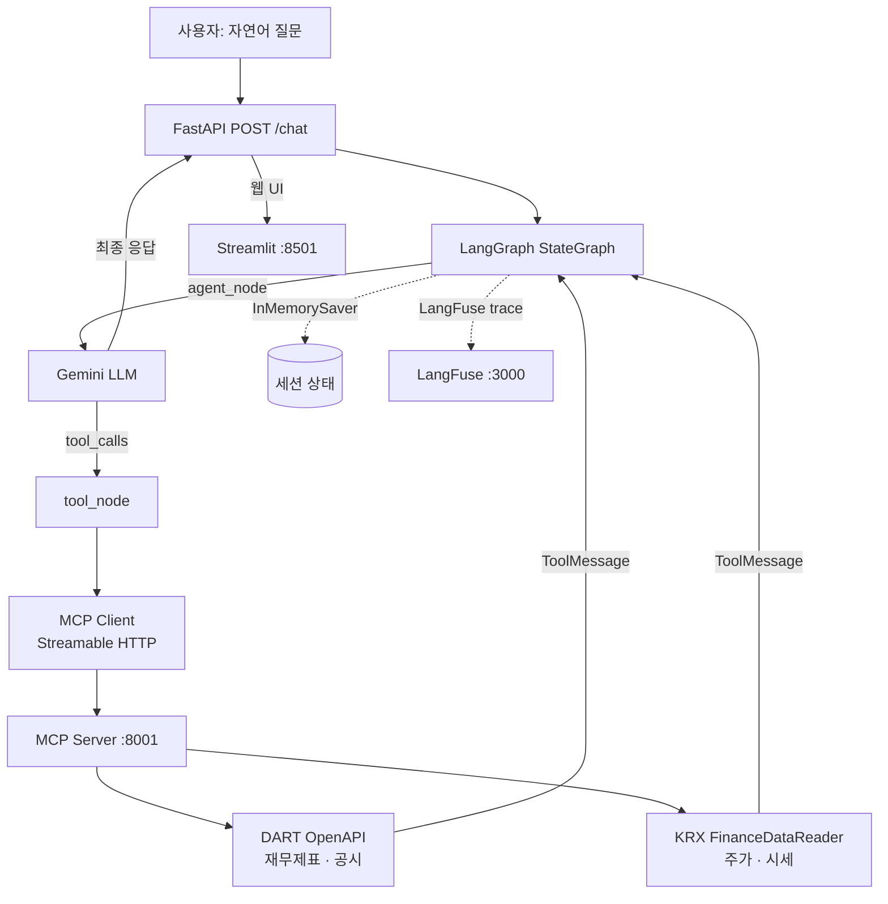
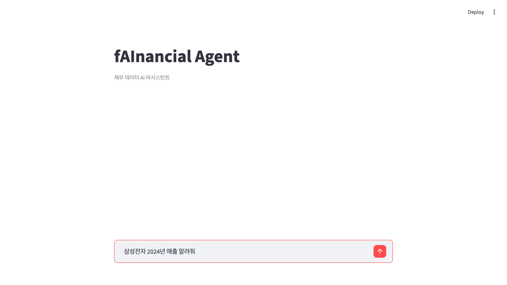
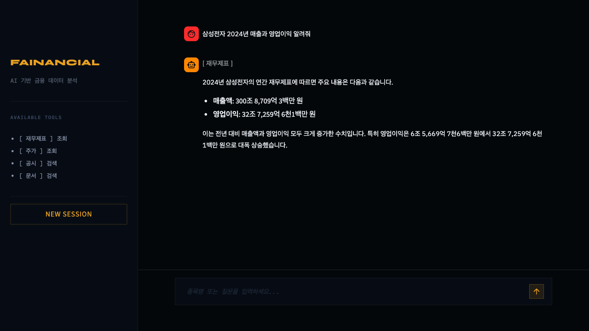

# fAInancial-agent

[](https://github.com/DvwN-Lee/fAInancial-agent/actions/workflows/ci.yml)

> 자연어로 한국 금융 데이터를 조회·분석하는 AI Agent
> MCP Tool + Gemini API + LangGraph

---

## 아키텍처



---

## 빠른 시작

```bash
# 1. 환경변수 설정
cp .env.example .env
# .env에 GEMINI_API_KEY, DART_API_KEY 입력

# 2. 전체 스택 실행
docker compose up

# 3. 웹 UI 접속
open http://localhost:8501

# 또는 API 직접 호출
curl -X POST http://localhost:8000/chat \
  -H "Content-Type: application/json" \
  -d '{"message": "삼성전자 2024년 매출 알려줘"}'
```

### LangFuse Observability (선택)

```bash
docker compose -f docker-compose.yml -f docker-compose.langfuse.yml up
# LangFuse 대시보드: http://localhost:3000
```

---

## 구조

```
fAInancial-agent/
├── mcp_server/          # MCP 서버 (DART + KRX Tool)
│   ├── main.py          # FastMCP Streamable HTTP 서버
│   ├── dart_tools.py    # DART OpenAPI 재무제표 · 공시 Tool
│   ├── krx_tools.py     # FinanceDataReader 주가 Tool
│   └── Dockerfile
├── agent/               # AI Agent
│   ├── main.py          # FastAPI POST /chat + GET /health
│   ├── graph.py         # LangGraph StateGraph Agent (Phase 2-B)
│   ├── loop.py          # Agent Loop 원본 (Phase 0 — 보존)
│   ├── session.py       # SessionStore 원본 (Phase 2-A — 보존)
│   ├── mcp_client.py    # MCP Streamable HTTP 클라이언트
│   └── Dockerfile
├── ui/                  # Streamlit 웹 UI (:8501)
│   ├── app.py           # 채팅 인터페이스
│   └── Dockerfile
├── tests/               # 단위 테스트 (pytest)
├── docker-compose.yml
└── .env.example
```

---

## 기술 스택

| 역할 | 라이브러리 |
|------|-----------|
| LLM | Gemini API (`langchain-google-genai`) |
| Agent 오케스트레이션 | LangGraph `StateGraph` + `InMemorySaver` |
| MCP 서버·클라이언트 | `mcp` 공식 SDK (Streamable HTTP) |
| RAG 임베딩 | Voyage AI `voyage-finance-2` |
| DART 공시 데이터 | `requests` (OpenDART API 직접 호출) |
| 주가 데이터 | `FinanceDataReader` |
| API 서버 | `FastAPI` + `uvicorn` |
| 배포 | Docker Compose |

---

## Agent 구현 비교: loop.py vs graph.py

| 항목 | Phase 0 (`loop.py`) | Phase 2-B (`graph.py`) |
|------|---------------------|------------------------|
| 오케스트레이션 | `while` 루프 + `function_calls` 파싱 | LangGraph `StateGraph` + 조건부 엣지 |
| 상태 관리 | `SessionStore` (dict + TTL) | `InMemorySaver` (checkpoint 자동) |
| LLM 연결 | `google-genai` 직접 호출 | `langchain-google-genai` 어댑터 |
| Tool 바인딩 | `FunctionDeclaration` 수동 변환 | `bind_tools()` |
| 메시지 프로토콜 | `types.Content` / `types.Part` | `HumanMessage` / `AIMessage` / `ToolMessage` |
| 세션 지속 | `session_id` → dict 수동 저장 | `thread_id` → checkpoint 자동 |
| 확장성 | 노드 추가 시 `if/elif` 분기 | 노드/엣지 선언적 추가 |

> `loop.py`와 `session.py`는 Phase 0 구현 참조용으로 보존됩니다.

---

## 데모

> `docker compose up` 후 http://localhost:8501

**환영 화면 — 예시 질문 버튼**


**질문 입력**


**응답 + Tool 뱃지**


---

## Phase 로드맵

| Phase | 목표 | 상태 |
|-------|------|------|
| **Phase 0** | MCP Agent 즉시 동작 | 완료 |
| **Phase 1** | RAG Tool 연동 (공시 문서 검색) | 완료 |
| **Phase 2-A** | Agent 고도화 (세션, 멀티 기업) | 완료 |
| **Phase 2-B** | LangGraph 마이그레이션 | 완료 |
| **Phase 3-A** | Streamlit UI + CI + LangFuse | 완료 |
| **Phase 3-B** | vLLM + K8s (별도 레포) | 대기 |
