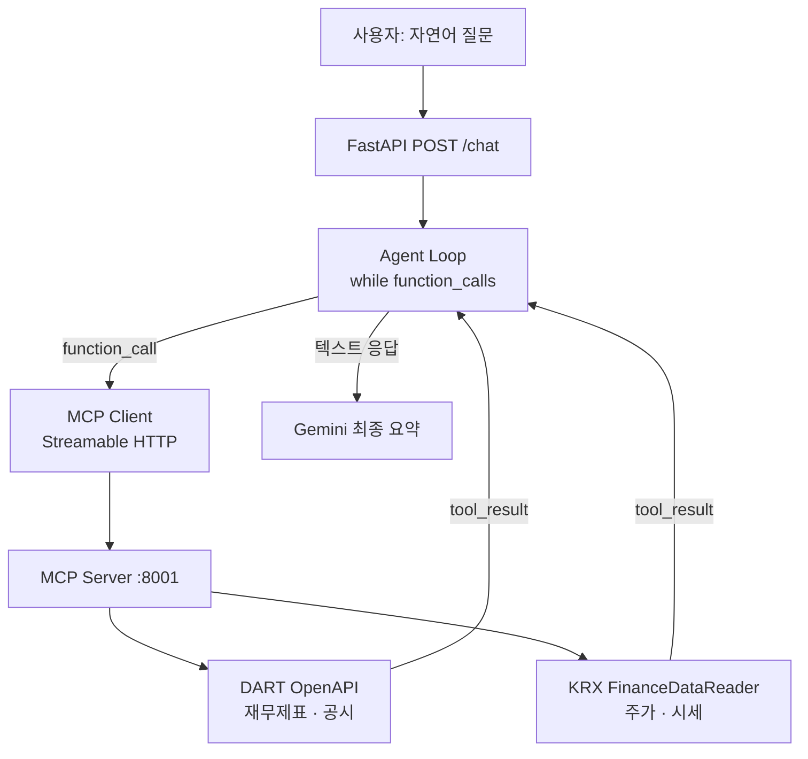

# fAInancial-agent

> 자연어로 한국 금융 데이터를 조회·분석하는 AI Agent
> MCP Tool + Gemini API — 프레임워크 없이 직접 구현

---

## 아키텍처



---

## 빠른 시작

```bash
# 1. 환경변수 설정
cp .env.example .env
# .env에 GEMINI_API_KEY, DART_API_KEY 입력

# 2. 실행
docker compose up

# 3. 질문
curl -X POST http://localhost:8000/chat \
  -H "Content-Type: application/json" \
  -d '{"message": "삼성전자 2024년 매출 알려줘"}'
```

---

## 구조

```
fAInancial-agent/
├── mcp_server/          # MCP 서버 (DART + KRX Tool)
│   ├── main.py          # FastMCP Streamable HTTP 서버
│   ├── dart_tools.py    # DART OpenAPI 재무제표 · 공시 Tool
│   ├── krx_tools.py     # FinanceDataReader 주가 Tool
│   └── Dockerfile
├── agent/               # AI Agent
│   ├── main.py          # FastAPI POST /chat + GET /health
│   ├── loop.py          # Agent Loop (while + function_call 직접 구현)
│   ├── mcp_client.py    # MCP Streamable HTTP 클라이언트
│   └── Dockerfile
├── tests/               # 단위 테스트 (pytest)
├── docker-compose.yml
└── .env.example
```

---

## 기술 스택

| 역할 | 라이브러리 |
|------|-----------|
| LLM | Gemini API (`google-genai`) |
| MCP 서버·클라이언트 | `mcp` 공식 SDK (Streamable HTTP) |
| DART 공시 데이터 | `requests` (OpenDART API 직접 호출) |
| 주가 데이터 | `FinanceDataReader` |
| API 서버 | `FastAPI` + `uvicorn` |
| 배포 | Docker Compose |

---

## Phase 로드맵

| Phase | 목표 | 상태 |
|-------|------|------|
| **Phase 0** | MCP Agent 즉시 동작 | 완료 |
| Phase 1 | RAG Tool 연동 (공시 문서 검색) | 대기 |
| Phase 2 | LangGraph vs CrewAI 비교 구현 | 대기 |
| Phase 3 | vLLM + LLMOps 프로덕션화 | 대기 |
